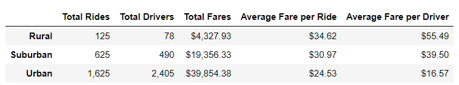
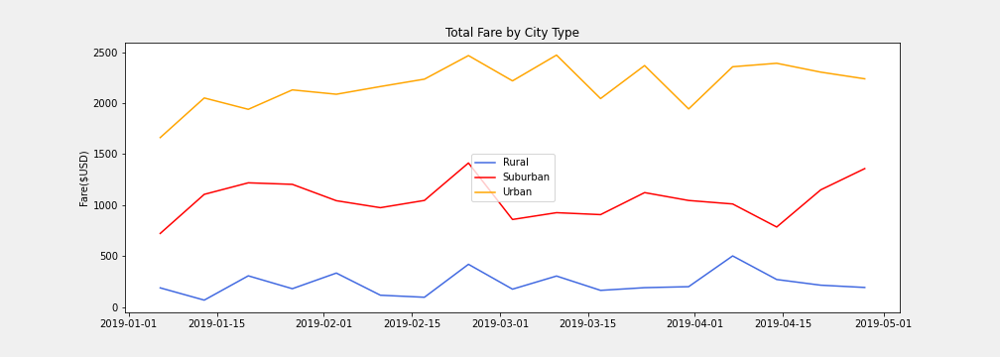

# PyBer Analysis Report

## Background and Results

### Purpose
    To get a better understanding of the ride-sharing market in the three city types.
### Technical Analysis
    Obtained key ride-sharing indicators for all three city types on a weekly basis.

### Results

    - Urban cities recorded the highest number of rides and drivers but also registered the lowest average fare per ride
      and the average fare per driver.

    - Rural cities recorded the lowest number of rides and drivers but the highest average fares per ride and driver.

    - This image illustrates that Rural cities recorded the lowest weekly fares compared to both Suburban and Urban cities.

### Summary
Rural cities registered the highest average fare per ride and average fare per driver because this market has fewer drivers 
compared to Urban and Suburban cities.  

## Challenges Encountered and Overcome

### Challenges and Difficulties Encountered
    I had no challenges. 

### Technical Analyses Used
    None required.

## Recommendations and Next Steps

### Recommendations for Future Analysis
    The Urban cities seem to be highly competitive and overserved with more drivers than rides.  
    I recommend pulling a percentage of drivers from these cities to operate in the underserved 
    cities, especially the Rural districts.
    
    In addition, to better serve our customers, I recommend a further drill down by providing a
    similar summary table for each city within the Rural, Suburban and Urban city types.
    
### Additional Analysis 1

* For each City Type, I propose to calculate the following for each city:
    1) Total Rides
    2) Total Drivers
    3) Total Fares
    4) Average Fare per Ride
    5) Average Fare per Driver

* Technical Steps
    - From merged DataFrame, I will create separate DataFrames for Urban, Suburban and Rural City 
      Types.
    - For each City DataFrame, perform similar coding in Pyber_Challenge.ipynb to calculate the
      above metrics.
    - Complete Summary Table for each City Type with the above metrics for each city.
      
### Additional Analysis 2

* From our Summary Tables for each City Type, I will then pull the top performing city (highest Total
  Fares) and the worst perfroming city (lowest Total Fares).  I will then proceed to construct a 
  multiple-line plot for the top cities from each City Type illustrating Total Fares on a monthly basis.
  I will construct a similar multiple-line plot for the worst performing cities from each City Type.

* Technical Steps
    - Use loc method to slice data from the DataFrames for each city that I want.
    - Merge the data to create top-performing and worst-perfoming DataBases.
    - Create pivot tables and use resample() method to get sum of the fares for each month for each city.
    - Construct line-plots.
