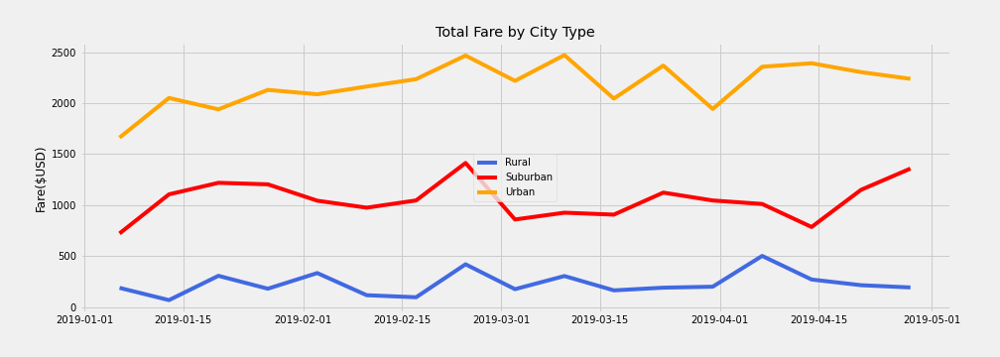

# PyBer_Analysis

# PyBer Analysis Report

## Background and Results

### Purpose
    To get a better understanding of the ride-sharing market in the three city types.
### Technical Analysis
    Obtained key ride-sharing indicators for all three city types on a weekly basis.
### Results

    - Urban cities recorded the highest number of rides and drivers but also registered the lowest average fare per ride
      and the average fare per driver.

    - Rural cities recorded the lowest number of rides and drivers but the highest average fares per ride and driver.

    - This image illustrates that Rural cities recorded the lowest weekly fares compared to both Suburban and Urban cities.

### Summary
Rural cities registered the highest average fare per ride and average fare per driver because this market has fewer drivers 
compared to Urban and Suburban cities.  

## Challenges Encountered and Overcome

### Challenges and Difficulties Encountered
    I had no challenges. 

### Technical Analyses Used
    None required.
    
## Recommendations and Next Steps
       
### Recommendations for Future Analysis
    The Urban cities seem to be highly competitive and overserved with more drivers than rides.  
    I recommend pulling a percentage of drivers from these cities to operate in the underserved 
    cities, especially the Rural districts.
    
### Additional Analysis 1

* Description of Approach

* Technical Steps

### Additional Analysis 2

* Description of Approach

* Technical Steps
